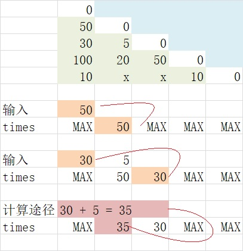

# Imperial Messengers 答题

## 分析
题目可以理解为：  
1. 有一个矩阵用来记录从 城市i 到 城市j 所需的时间。  
2. 从 城市0 出发到另一城市，可以通过直达或者途径其他城市的方式。
3. 找到到达其他每个城市的最短时间，并求出其中最长的时间。

输入格式：  
1. 城市的数量n
2. 矩阵A的下半三角部分的元素，A(1, 0)
3. A(2, 0) 和 A(2, 1)
4. 以此类推

矩阵的形式：
1. 如果输入是 x ，则表示两个城市之间不连通（代码中处理成-1）。  
2. 如果 i == j ，则时间为 0 。  
3. A(i, j) == A(j, i) 。
所以根据输入的数据得到的矩阵为：  
  
加上默认的 0 ，应该为：  
  
填满镜像数据后，应该为：  
  

> 这道题实际计算并不需要填满镜像，使用Sample02.jpg的矩阵就可以了。

## 思路
1. 使用一个数组记录到达各个城市的时间。这个数组中的元素将记录和保持到达该城市的最优时间，初始值是个最大值。
2. 按行输入数据，根据新输入的数据，对数组中的记录进行更新。
3. 数据中除了直达的数据外，还有途径其他城市的数据，对这部分数据与对应的城市数据相加，如果更优则对记录更新。
4. 如果对一个记录有更新操作，那么涉及到途径这个城市的记录也应该更新，所以需要一个递归操作重新处理之前行的数据。

简要流程举例：  
1. 输入 50 ，更新到数组times。
2. 输入第二行数据，30 5，30先更新到数组times中。
3. 处理A(2, 1)，计算30 + 5更优，将结果更新到数组times中。

  

## 特殊处理
1. 当修改了一个城市的时间，而那个城市会被另一个城市途径时，数据更新出现问题。  
解决方案：递归处理。  
用例：  
5  
40  
30 5  
20 10 5  
10 20 10 5  

2. 当这个城市不能直接到达，需要等待别的城市计算好途径时间。  
解决方案：如果没有获得这个城市的时间，尝试通过途径方式计算本城市的时间，如果还是不能获得，跳过，等待后面的数据。  
用例：  
5  
x  
x 10  
x x 10  
10 x x 10  

3. 假设到达城市的时间是int型范围，那么由途径才能到达的城市有可能会突破int型范围。  
解决方案：到达时间的记录数组使用unsigned int。  
用例：  
5  
2147483647  
x 10  
x x 10  
x x x 10  

## 解决问题时间
分析：1个小时  
编码：2个小时  
调试：3个小时  
文档：1个小时  

总计约7个小时  